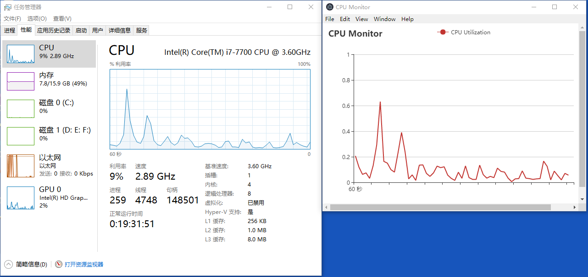

# CPU Monitor

## 简介
windows 上一款仿任务管理器的能够实时显示 CPU 利用率的 `electron` 桌面应用

## 技术路线
用 C++ 编写一个获取 CPU 信息的函数，用 `node-gyp` 打包这个 C++ 模块，然后在 js 中使用这个模块。使用 `echarts` 来绘制折线图，每秒钟更新一次图表数据。由于其中的 C++ 模块用到了头文件`<windows.h>`，故项目只能运行于 windows 平台

## 运行方式
下载 `electron-v4.0.3-win32-x64` 的压缩包，解压之后在 `electron-v4.0.3-win32-x64` 的目录里执行以下命令：
```
start electron.exe {本项目的路径}
```

## 运行截图
